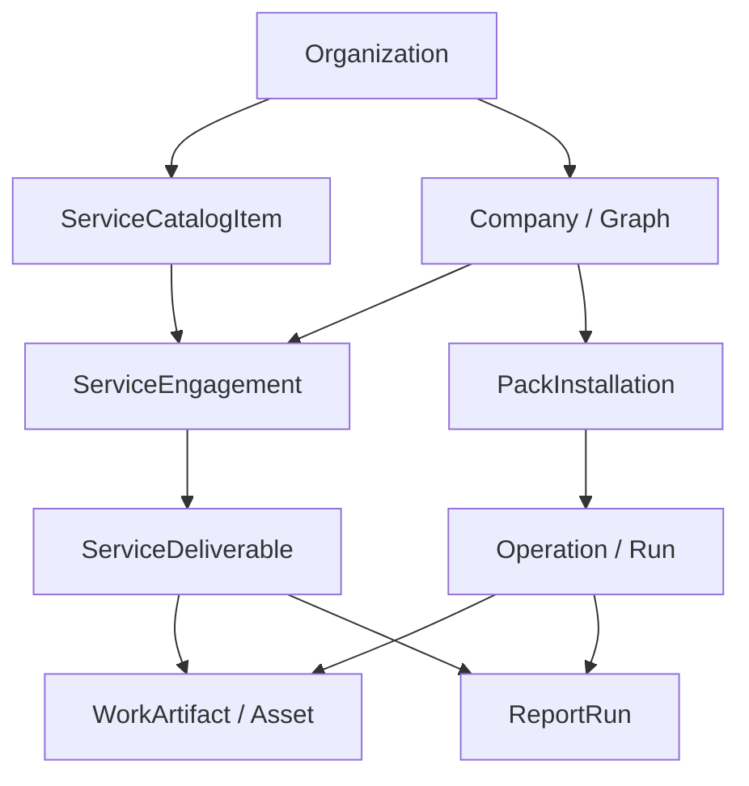
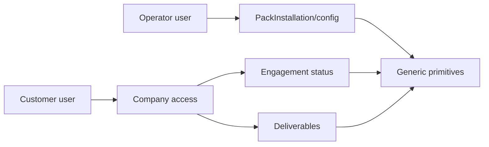

# Multi-Company, Multi-Pack, Portfolio, And Service Operations Plan

## Executive Summary

ForgeGraph supports two product modes on the same backend primitives:

- **Operator mode:** an organization manages one or more companies, installs packs into each company, and operates across portfolio read models.
- **Service mode:** a customer buys or requests a named service and only sees intake, status, approvals, and deliverables while ForgeGraph maps the work into company-scoped packs, operations, artifacts, reports, and approvals.

These modes must not create separate core business-specific models. ATLAS, Legacy, marketing, accounting, legal, consulting, and similar offerings remain metadata in packs and service catalog items. The generic core owns the durable structure.

The current Company implementation is `Graph`. A `Company` is the hard client/business data boundary. A user should usually create one company for the real business, such as `Legacy Eyewear`, then add marketing, accounting, legal, consulting, inventory, pricing, and reporting packs to that company. Internal functions should not become separate companies unless they are genuinely separate business/legal/client entities.

## Boundaries

- **Organization:** operator, agency, or account boundary.
- **Company:** client/business/data isolation boundary. Current durable model: `Graph`.
- **PackInstallation:** internal capability/module boundary inside one company.
- **ServiceCatalogItem:** customer-facing offer or productized service facade.
- **ServiceEngagement:** company-scoped service request/purchase/delivery lifecycle.
- **ServiceDeliverable:** customer-facing wrapper around backend-owned artifacts or reports.
- **Portfolio:** cross-company read model only. It must not own raw client data.
- **Generic primitives:** cross-pack coordination boundary: `CompanySignal`, `WorkArtifact`/`Asset`, `MetricSnapshot`, `EvaluationRun`, `ReportRun`, `StateProjection`, `OperationRecommendation`, `Operation`/`Run`, `Task`, `Approval`, and `Decision`.

## Dual Objective Constraints

Service mode is additive and sits above packs:

```text
Customer service surface
  ServiceCatalogItem -> ServiceEngagement -> ServiceDeliverable/Status/Approval

Internal ForgeGraph surface
  Company -> PackInstallation -> Operation/Task/Artifact/Report/Metric/Approval
```

Hard constraints:

- Do not expose pack config, namespace claims, runtime manifests, or private pack state to service customers by default.
- Do not make `ServiceEngagement` the owner of company data. It references company-scoped primitives.
- Do not create `/api/marketing/*`, `Marketing*`, `Atlas*`, or Legacy-specific core models.
- A service offer may require or recommend packs, but packs remain internal capabilities.
- Intake data becomes company-scoped artifacts, state projections, metrics, or engagement metadata according to sensitivity and reuse.
- Service deliverables reference `WorkArtifact`/`Asset` or `ReportRun`; they do not duplicate raw deliverable content.
- Customer-facing access must be narrower than operator access: engagements, intake, status, approvals, and deliverables only.
- All durable state mutations remain backend-owned per `docs/architecture/runtime-invariants.md`.

## Target Entity Additions

### ServiceCatalogItem

- **Status:** add generic model.
- **Purpose:** productized service offer, such as a growth audit, legal intake review, accounting readiness check, or consulting package.
- **Storage:** persisted organization-scoped metadata.
- **Main fields:** organization, slug, title, description, status, visibility, audience, required_pack_ids, optional_pack_ids, intake_schema, deliverables_schema, default_operation_templates, default_report_template_id, pricing_metadata, metadata.
- **Security:** org viewer can list active visible offers; org admin manages offers.
- **Acceptance:** service catalog can represent ATLAS or any future service without core model changes.

### ServiceEngagement

- **Status:** add generic model.
- **Purpose:** one requested/purchased service for one company.
- **Storage:** persisted company-scoped lifecycle record.
- **Main fields:** organization, company, catalog_item, status, customer_status, intake_data, assigned_operator, requested_by, started_at, delivered_at, completed_at, metadata.
- **Security:** company access required. Customer role can see customer-facing fields only.
- **Acceptance:** same-organization users without company access cannot see or mutate engagements.

### ServiceDeliverable

- **Status:** add generic model.
- **Purpose:** customer-facing deliverable row referencing backend-owned output.
- **Storage:** persisted company-scoped wrapper around `Asset` or `ReportRun`.
- **Main fields:** organization, company, engagement, title, deliverable_type, status, artifact, report_run, visibility, summary, metadata.
- **Security:** company access required; public/customer view never exposes raw private metadata or secrets.
- **Acceptance:** deliverables can be listed by engagement and never leak another company's artifacts/reports.

## Implementation Staging

### P1 Service Facade Slice

1. Add `ServiceCatalogItem`, `ServiceEngagement`, and `ServiceDeliverable`.
2. Add generic APIs:
   - `GET/POST /api/service-catalog`
   - `GET/PATCH /api/service-catalog/{id}`
   - `GET/POST /api/service-engagements`
   - `GET/PATCH /api/service-engagements/{id}`
   - `GET/POST /api/service-engagements/{id}/deliverables`
   - `POST /api/service-deliverables/{id}/actions` with `{ "action": "mark_ready" | "submit_for_approval" | "deliver_to_client" | "accept" }`
   - First-class lifecycle aliases: `POST /api/service-deliverables/{id}/mark-ready`, `/submit-for-approval`, `/deliver-to-client`, and `/accept`
3. Enforce organization membership first, then company access for engagements and deliverables.
4. Add route security matrix entries.
5. Add wrong-company and secret-redaction tests.

### P1/P2 Customer Portal Slice

1. Add a customer-facing engagements page.
2. Show service status, intake state, approvals, and deliverables.
3. Hide packs, runtime manifests, namespace claims, internal task queues, and private config.
4. Add service offer install/request flows that validate required packs internally.

## Diagrams





## First Service Implementation Slice

Implement the backend facade first:

1. Generic service catalog model and APIs.
2. Company-scoped service engagement model and APIs.
3. Service deliverable wrapper model and APIs.
4. Wrong-company access tests.
5. Matrix coverage.

Do not build a specialized ATLAS or marketing API. ATLAS should be represented by catalog item metadata and pack requirements.
